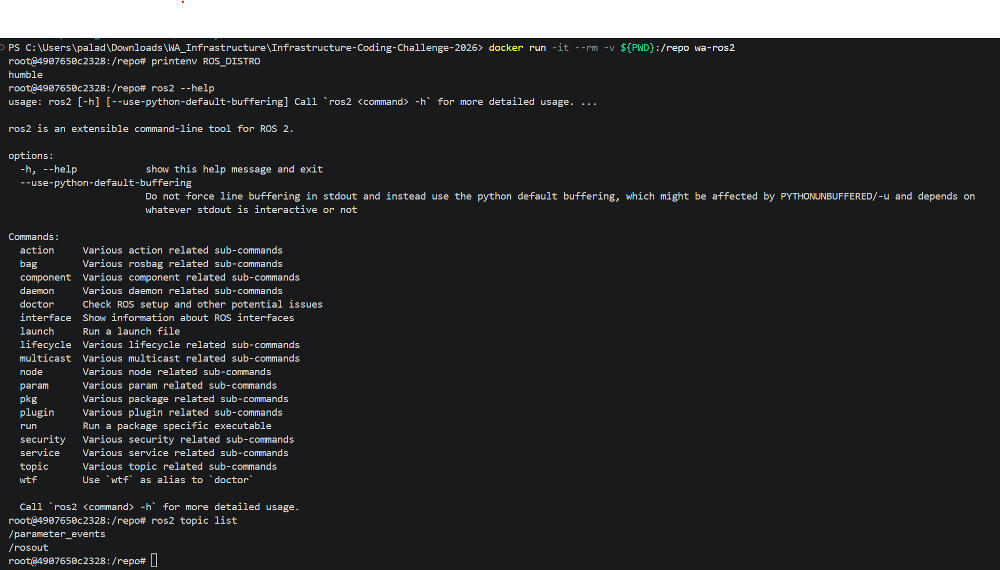

# Infrastructure-Coding-Challenge-2026

Hello prospective member!

Throughout this challenge, you will interact with several of the core tools and technologies used by the Infrastructure subteam:

- **[Git](https://git-scm.com/book/en/v2/Getting-Started-Installing-Git) & GitHub** for version control and submitting your work
- **[Docker](https://docs.docker.com/get-started/get-docker/)** for creating a reproducible development environment
- **[ROS 2](https://docs.ros.org/en/humble/Installation.html)** for creating your package and running your node
- **C++ or Python** for implementing your code
- **[Colcon](https://docs.ros.org/en/humble/Tutorials/Beginner-Client-Libraries/Colcon-Tutorial.html)** for building your ROS 2 workspace
- **Command line** for building, running, and interacting with your environment

Prior experience with these tools is not expected.

There are two main components to this coding challenge: environment setup and an open-ended coding challenge.

## Environment Setup

This component is kept intentionally sparse of a guide or resources; a large part of being onboarded to Wisconsin Autonomous is growing to feel comfortable adapting to tools you may not be previously familiar with. 

ROS 2 is our middleware of choice. It allows independent programs, called nodes, to communicate through topics, services, and actions, which lets us connect sensors, localization, planning, and control into one larger software stack.
For this part of the challenge, your goal is to set up a development environment. In order:
1. Create a Dockerfile using an Ubuntu 22.04 LTS (Jammy Jellyfish) base image.
2. Install ROS 2 Humble inside the container.
4. Build and run the container.
5. Verify that ROS 2 is working by successfully running the `ros2` command inside the container. 
6. Fork then clone this repository into the container and create your [ROS 2 workspace](https://docs.ros.org/en/humble/Tutorials/Beginner-Client-Libraries/Creating-A-Workspace/Creating-A-Workspace.html) inside the repository.

## Open-Ended Coding Challenge

There is no single program you are expected to build. Instead, your program must satisfy a small set of requirements listed below. What you build around those requirements is entirely up to you. Building an elaborate program is welcome, but unnecessary. Completion of the requirements and understanding what your code is doing are what matter; the sophistication of your program will not be considered as part of your application. Here are the requirements:

A ROS 2 package that...
- Has at least one node that subscribes to 2 inputs, and publishes one output
- Has at least 3 topics (If you choose to use `ros2 topic pub` just leave the commands you use in the README when submitting)
- Has at least 2 callback functions that each correspond to a unique topic
- Has at least one function that aggregates the 2 inputs and publishes the final output
- Is written in C++ or use [Python (rclpy)](https://docs.ros.org/en/foxy/Concepts/About-ROS-2-Client-Libraries.html)
- .gitignore for build/ install/ log/
- Successfully builds using `colcon build`

**Hint:** The most baseline package should look like this:

/input_topic_a, /input_topic_b -> node -> /output_topic
                      
### Submission

Your repository you hand off to me should have:

- The commands needed to build and run your program
- Any `ros2 topic pub` commands used to provide input
- A short description of what your program does
- Your Dockerfile
- Your workspace and packages
- A screenshot of your command line successful running `ros2` or any other command that proves your environment is functional

## Notes Before Starting:
- Fork then clone this repository and do all your work in that directory, you will be pushing your code to github and submitting the link in the google form when complete.
- This is meant to be a practical in independently setting up and using industry standard tools. Therefore you should use any tools you're comfortable with for gathering information and learning. This can be consulting a friend, the internet, [documentation](https://docs.ros.org/en/foxy/Releases/Release-Humble-Hawksbill.html), or LLMs.
- The requirements to complete this coding challenge are intentionally kept simple in order to make earnestly engaging with the task reasonable
- If you have any extenuating circumstances (For example a computer that cannot run any of the stated software) that make completing this challenge impossible, or you have any questions (I will help you if needed) contact nkujava@wisc.edu
- Good luck and don't feel intimidated, you can do it!

---

# My Submission (brocclee299)

## What the program does

`aggregator_node` (package `aggregator_pkg`, Python / rclpy) subscribes to two `std_msgs/Float64` topics, `/input_topic_a` and `/input_topic_b`. Each topic has its own callback (`callback_a`, `callback_b`) that stores the latest value. Once both inputs have arrived, the `aggregate()` function averages them and the node publishes the result on `/output_topic`.

```
/input_topic_a ─┐
                ├─> aggregator_node ──> /output_topic   (average of a and b)
/input_topic_b ─┘
```

## Build and run

Run these from the repository root on the host (PowerShell).

Build the image and start the container (the repo is mounted at `/repo`):

    docker build -t wa-ros2 .
    docker run -it --rm -v ${PWD}:/repo wa-ros2

Inside the container, build and run the node:

    cd /repo/ros2_ws
    colcon build
    source install/setup.bash
    ros2 run aggregator_pkg aggregator_node

## Inputs (`ros2 topic pub`)

In separate terminals, attach to the same container with `docker exec -it <container_name> bash` (find the name with `docker ps`), run `source /repo/ros2_ws/install/setup.bash`, then:

    ros2 topic pub /input_topic_a std_msgs/msg/Float64 "{data: 10.0}" -r 1
    ros2 topic pub /input_topic_b std_msgs/msg/Float64 "{data: 20.0}" -r 1

Watch the output (should print `data: 15.0`, the average of 10.0 and 20.0):

    ros2 topic echo /output_topic

## Environment proof

`printenv ROS_DISTRO` prints `humble`, and `ros2 --help` and `ros2 topic list` run successfully inside the container:


